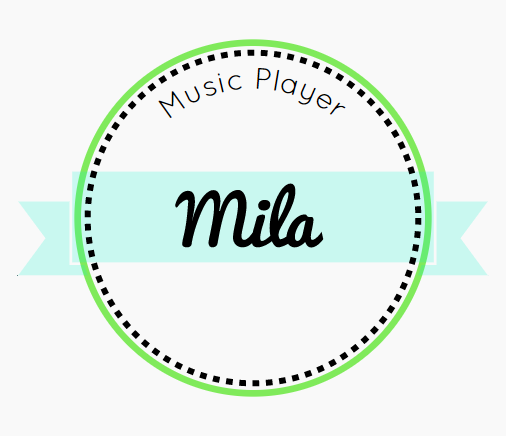

# Music player Mila

## How to setup

```bash
# clone repo
git clone https://github.com/OzzyMalv/music_player.git

# go to directory
cd music_player

# install dependencies
npm install

# run app
gulp
```

## Start page

## logo



## App structure

## Technologies and tools

## App info