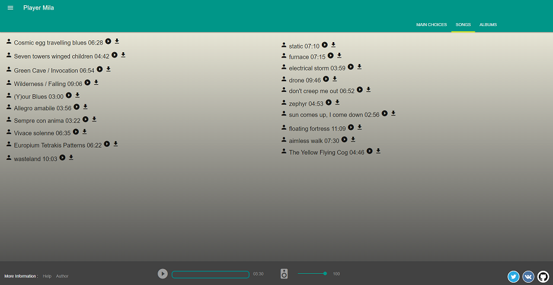

# Music player Mila

## How to setup

```bash
# clone repo
git clone https://github.com/OzzyMalv/music_player.git

# go to directory
cd music_player

# install dependencies
npm install

# run app
gulp

```

## Deploy script

```bash
npm run build:deploy

```

## Start page



## App structure

## Technologies and tools

- [MDL](https://getmdl.io)
- [FMA free music](http://freemusicarchive.org)
- [yandex music api](https://tech.yandex.ru/audio/jsapi/)

## App info

- [Presentation](http://slides.com/alex_malv/deck/fullscreen)
- [Deploy](https://ozzymalv.github.io/music_player/)